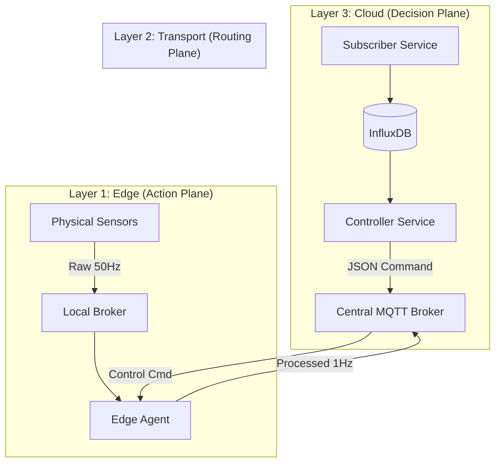

# System Architecture & The Feedback Loop

## 1. Detailed Architecture Specification
The system utilizes a **3-Layer Hierarchical Architecture** designed to respect the principles of Fog/Edge Computing. This structure ensures that network failures between layers do not result in total system blindness (local survivability).



### Layer 1: The Edge (Computing & Action)
*   **Physical Deployment**: `devices-node` VM running K3s (Kubernetes).
*   **Key Components**:
    *   **Publishers (Sensors)**: Python scripts simulating pump physics. They publish raw data at **50Hz** (20ms interval). They represent the "Physical World".
    *   **Local MQTT Broker**: An infrastructure component running *inside* the cluster. It ensures that raw high-speed data stays local and does not traverse the WAN.
    *   **Edge Agent**: The primary logic unit. It implements "Stream Processing":
        *   *Ingestion*: Consumes 50 messages/sec.
        *   *Physics Engine*: Checks `Flow > Expected` logic on every single message.
        *   *Aggregation*: Summarizes 50 messages into 1 message (in Normal mode).
        *   *Actuation*: Can change its own aggregation logic dynamically based on commands.

### Layer 2: Transport (Decoupling)
*   **Physical Deployment**: `mqtt-node` VM running Docker Mosquitto.
*   **Role**:
    *   Acts as the **Demilitarized Zone (DMZ)** between the secure Cloud and the insecure field devices.
    *   Topic Routing: Separates `iot/data` (Telemetry) from `iot/control` (Commands).
    *   This layer is "dumb"—it does not process data, only moves it.

### Layer 3: Cloud (Intelligence & History)
*   **Physical Deployment**: `cloud-node` VM running Docker Compose.
*   **Key Components**:
    *   **Cloud Subscriber**: A scalable ingestion service that writes to Time-Series Storage.
    *   **InfluxDB**: The "System Memory". Stores historical telemetry and current state.
    *   **Controller**: The "System Brain". It is a closed-loop control system that queries the database and issues commands.

---

## 2. The Feedback Loop Logic (The "Fairness Algorithm")

The core contribution of this thesis is the **Feedback Controller logic**. This runs as a continuous loop (10s interval) in `cloud-node/controller.py`.

### The State Machine
The Controller utilizes a hierarchical state machine to determine the global operating mode.

#### Inputs (Sensing)
1.  **Leak Flag (Safety)**: Query InfluxDB for `max(leak_flag)` over the last 30s.
    *   *Source*: Edge Agents (via Telemetry).
2.  **Cloud CPU (Constraint)**: Query Prometheus for `node_cpu_seconds_total`.
    *   *Source*: Infrastructure Monitoring.

#### Logic (Deciding)
The "Fairness Algorithm" applies these rules in strict priority order:

1.  **Rule 1: Criticality Override**
    *   *IF* `Leak Detected`: Force `DEBUG` Mode (50Hz).
    *   *Rationale*: A leaking pipe costs more than bandwidth. Ignore CPU limits. Safety first.
    
2.  **Rule 2: Protection (Hysteresis)**
    *   *IF* `Cloud CPU > 80%` AND `No Leak`: Enter `ECONOMY` Mode.
    *   *IF* `Cloud CPU < 60%` AND `Was Economy`: Exit `ECONOMY` Mode.
    *   *Rationale*: Protect the ingestion pipeline from crashing under load.
    
3.  **Rule 3: Optimality**
    *   *IF* `Cloud CPU < 20%` (Idle): Enter `DEBUG` Mode.
    *   *Rationale*: If we paid for the cloud resources, we should use them to gather high-fidelity data for training.
    
4.  **Rule 4: Default**
    *   *ELSE*: Maintain `NORMAL` Mode (1Hz).

#### Output (Acting)
*   The Controller publishes a JSON payload to `iot/control/{site_id}`:
    ```json
    { "mode": "DEBUG" }
    ```
*   The Edge Agent receives this and immediately reconfigures its `aggregate_data()` function.

---

## 3. Technology Stack Justification
Why were these specific technologies chosen?

*   **MQTT (Mosquitto)**: Lightweight, created for unreliable networks (oil/gas monitoring). Standard in IoT.
*   **InfluxDB**: Optimized for high-write loads. Essential for handling the 50Hz "bursts" of data during leaks.
*   **K3s (Kubernetes)**: Proves the Edge architecture is container-native and orchestratable, not just scripts on a Raspberry Pi.
*   **Prometheus**: Industry standard for infrastructure monitoring, essential for the "Cloud CPU" feedback signal.
